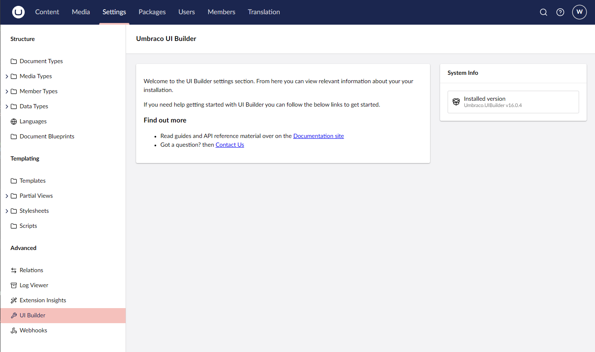

# Lesson 1: Installation

Installing UI builder is as easy as installing the correstponding nuget package for the version of Umbraco that you are using. 

At the time of this workshop we are using version 16 of Umbraco so we can install the latest nuget package of `Umbraco.UIBuilder`. Do this by either using the Visual Studio nuget package manager or open up your console to the `Web` project and run the following command.

```
dotnet add package Umbraco.UIBuilder
```

We will also be adding configuration code to the `Core` project to keep things organized and the `Web` project cleaner. To do this we will need to install the `Umbraco.UIBuilder.Startup` package to the `Core` project. Either do this in the Visual Studio nuget package manager or run the following command in the `Core` project.

```
dotnet add package Umbraco.UIBuilder.Startup
```

> Note: If you are using a earier version of Umbraco which is not the latest, target the latest major version of `Umbraco.UIBuilder` which matches the Umbraco major version you are using for compatability.

That's all there is to it. You should now be able to run the `Web` project and navigate to the `Settings` section. From there you can verify UI Builder has been installed by the existance of the UI Builder menu option under Advanced.

