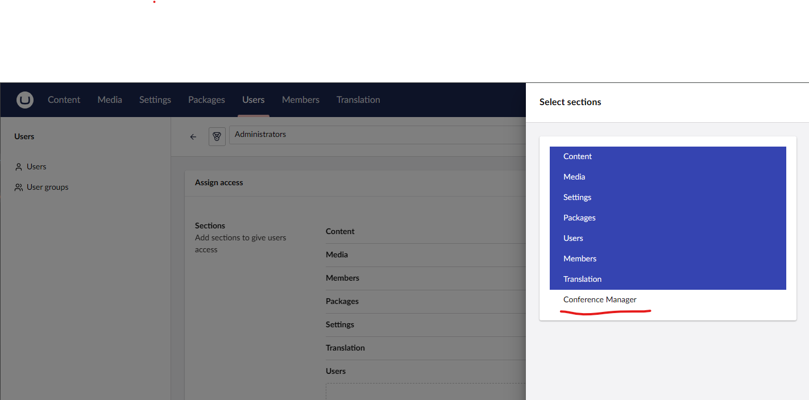

# Lesson 2: Initial Setup and First Section

We are now ready to start configuring UI Builder to show our entites.

Begin by creating a new file in the `Core` project at `Configuration/UIBuilderExtensions.cs`

Add the following code to the file to setup our first section.

```csharp
using Umbraco.Cms.Core.DependencyInjection;
using Umbraco.UIBuilder.Extensions;

namespace UIBuilderWorkshop.Core.Configuration;

public static class UIBuilderExtensions
{
    public static IUmbracoBuilder AddWorkshopUIBuilder(this IUmbracoBuilder umbracoBuilder)
    {
        umbracoBuilder.AddUIBuilder(configuration =>
        {
            configuration.AddSection("Conference Manager");
        });

        return umbracoBuilder;
    }
}

```

Here we are creating an extension method off `IUmbracoBuilder` to configure UI Builder and its associated services. We call the the `AddUIBuilder` method off of the Umbraco builder to start adding our configuration to the UI Builder. The UI Builder uses lamda expressions to create fluent syntax to create and configure the different pieces of the UI as you will see going forward. For now we are just going to add a new section to the backoffice named "Conference Manager".

Go the the `Program.cs` file in the `Web` project and modify the builder to include our new extension method.

```csharp
builder.CreateUmbracoBuilder()
    .AddBackOffice()
    .AddWebsite()
    .AddComposers()
    .AddWorkshopUIBuilder() // Add this here
    .Build();
```

Run the project and navigate to the backoffice. Where is our section? It's not missing, we just don't have access to it yet. UI Builder sections work just like any other Umbraco custom section that it needs to be added as a avaliable section to a User Group in the backoffice. 

Navigate to the Users section in the backoffice and select the `User Groups` side menu option. Select the `Administrators` group and add our new section to the sections editor.



Reload the backoffice and you will see a new section appear in the top menu mirroring our configuration. Notice that the route has been auto genereated for us by using the name of the section.

```
https://localhost:44329/umbraco/section/conferencemanager
```

If for some reason in the future we would have a naming conflict with two sections or if you just want to update the segment to identify the UI Builder section, you can do this by calling the following method in the section to manually set the segment.

```csharp
configuration.AddSection("Conference Manager", sectionConfiguration =>
{
    sectionConfiguration.SetAlias("workshop2025");
});
```

```
https://localhost:44329/umbraco/section/workshop2025
```