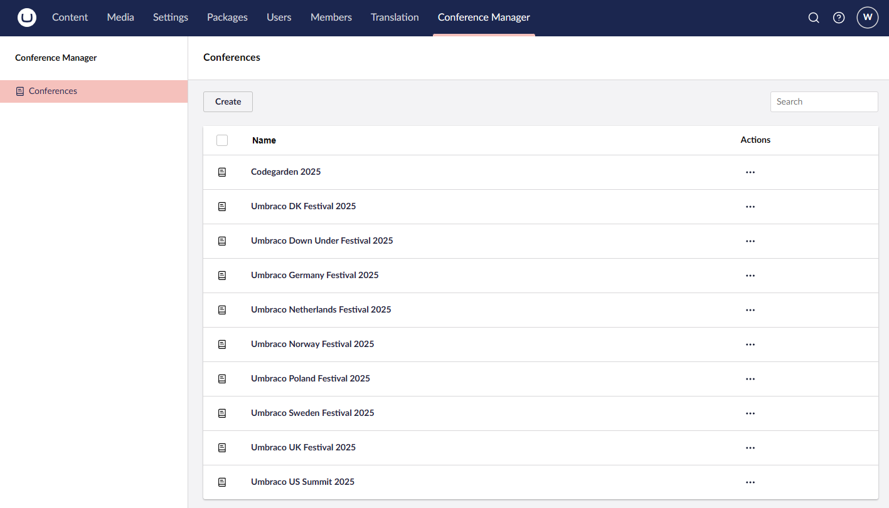
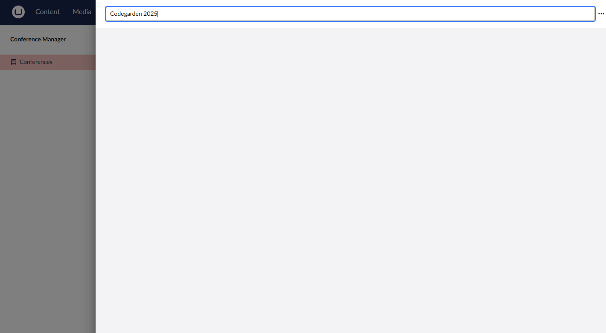
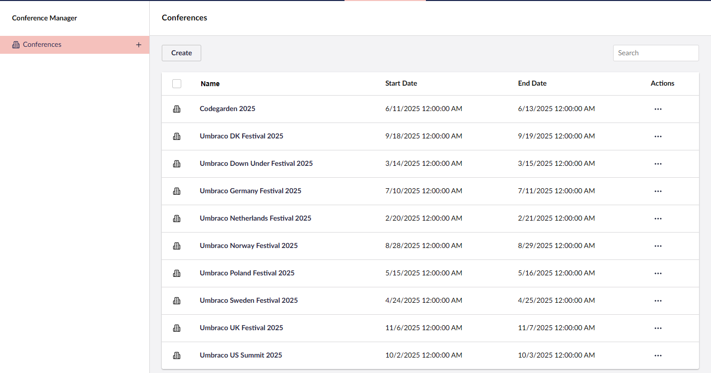

# Lesson 3: Scaffolding Our First Collection
The next level down from a section are collections. Collections are a way to configure and access our list views and editors for entites in the database. Lets create our first collection for the `Conference` entity to see how things are set up.


## Setup a Collection
Update the `UIBuilderExtensions.cs` file with the following snippet.

```csharp
using UIBuilderWorkshop.Data.Models;
using Umbraco.Cms.Core.DependencyInjection;
using Umbraco.UIBuilder.Extensions;

namespace UIBuilderWorkshop.Core.Configuration;

public static class UIBuilderExtensions
{
    public static IUmbracoBuilder AddWorkshopUIBuilder(this IUmbracoBuilder umbracoBuilder)
    {
        umbracoBuilder.AddUIBuilder(configuration =>
        {
            configuration.AddSection("Conference Manager", sectionConfiguration =>
            {
                sectionConfiguration.Tree(treeConfiguration =>
                {
                    treeConfiguration.AddCollection<Conference>(x => x.Id, 
                                                                "Conference", 
                                                                "Conferences", 
                                                                "A collection of conferences.", 
                                                                "icon-company", 
                                                                "icon-company", 
                                                                collectionConfiguration =>
                                                                {
                                                                    collectionConfiguration.SetNameProperty(x => x.Name);
                                                                });
                });
            });
        });

        return umbracoBuilder;
    }
}

```

With just this little bit of configuration we get our first glimpses at what UI Builder can provide for us.



Clicking on one of the times, we also get a scaffoleded editor to start to configure.



Lets break down what the `AddCollection` extension method is doing here. 

```csharp
treeConfiguration.AddCollection<Conference>(x => x.Id, 
                                            "Conference", 
                                            "Conferences", 
                                            "A collection of conferences.", 
                                            "icon-company", 
                                            "icon-company", 
                                            collectionConfiguration =>
                                            {
                                                collectionConfiguration.SetNameProperty(x => x.Name);
                                            });
```

1. We pass it the C# class we want to express with this collection. In our case, we are trying to display the `Conference` class
2. The first argument is a lamda expression to let UI Builder know which property on the class it should use as the primary key for routing and other services.
3. The next two parameters set the text to display for when the plural of the entity is being shown and another for when a single version of that entity is shown. The example of this is on the list view and the tree using `Conferences` as the plural text to display.
4. The next parameter is a friendly description of the collection.
5. The next two parameters are the icons to use when displaying as a collection or a single item. The collection icon would be used in the tree element for example, while the single icon would be used on the individual items in the list view.

> Note: Hot reload does not work for the UI Builder as the configuration is read at startup. Any changes need to be applied by restaring the application.

## Enhancing the list view
Lets add more fields and configuration to this list view to make it more useful.

### Adding Fields
Adding fields to display in a list view requires the use of the `ListView` extension method on the collection. It's here where will define the aspects of a list view that the backoffice user can see and interact with.

Add the following snipped inside of the collection configuration.

```csharp
collectionConfiguration.SetNameProperty(x => x.Name);

// Define the list view
collectionConfiguration.ListView(listViewConfiguration =>
{
    listViewConfiguration.AddField(x => x.StartDate);
    listViewConfiguration.AddField(x => x.EndDate);
});
```

Restart the application and we can see that we now have 2 extra fields in out list view.



We can see that the 2 new fields are avaliable on the list view and it even generated the header text based on splitting the pascal case property names. 

What if we want to give our users more friendly date formats? This can be achieved by using the `SetFormat` extension method where we can manipulate the value before it's displayed to the screen.

```csharp
listViewConfiguration.AddField(x => x.StartDate).SetFormat(x => x.ToShortDateString());
```

Do the same for the `EndDate` property and see the effects after restarting the application.

### Ordering the List
Now that we have a nice list view, it would be helpful to sort these items based on their date. This can be done using the `SetSortProperty` on the collection which helps you to define the default sort property and direction for the list.

```csharp
// Define the default sorting
collectionConfiguration.SetSortProperty(x => x.StartDate);
```

### Prefiltering a List
Often times it doesn't make sense to display all of the data to the user by default and there is a requirement to show a subset of the data. Lets do this by utilizing the [data views](https://docs.umbraco.com/umbraco-ui-builder/filtering/data-views) feature which UI Builder supplies.

Add the following to the configuration to start the list view in an Upcomming Conferrences state followed by an All state so that someone can view all of the conferneces if they want to.

```csharp
// Define Data Views
collectionConfiguration.AddDataView("Upcomming", x => x.StartDate >= DateTime.Now.Date);
collectionConfiguration.AddAllDataView();
```

### Displaying Data beyond .ToString()
Though UI Builder makes it easy to put things into a list view, what if want to give the user a richer experiance for data in one of the columns. This is where the [field views](https://docs.umbraco.com/umbraco-ui-builder/collections/list-views/field-views) feature becomes helpful. Using this we can create a Partial View or View Component to add more logic to one of our columns and add visual flair. 

Let's create a column that displays how many days the conference is and change its appearance based on if its a single, double or multi day event.

Add a view partial in the `Web` project at `/Views/Shared/Components/FieldView/ConferenceLength.cshtml` with the following contents

```csharp
@using UIBuilderWorkshop.Data.Models
@model Umbraco.UIBuilder.Web.Models.FieldViewContext
@{
    if (Model.Entity is not Conference conference) return;

    var length = conference.EndDate.Date - conference.StartDate.Date;
    var days = length.Days + 1;
}

@if (days == 1)
{
    <uui-tag look="secondary">1 day</uui-tag>
}
else
{
    var color = days > 2 ? "danger" : "default";
    <uui-tag look="primary" color="@color">@days days</uui-tag>
}
```

Then add the following to the list view configuration

```csharp
listViewConfiguration.AddField(x => x.Id).SetHeading("Length").SetView("ConferenceLength");
```

Since our parital is computing a brand new property which does not exist on the entity, the field added does not need to be relevant. What we are doing though is setting the header for the column though and telling it which partial view to use when rendering this column cell. The entity is passed through as a part of the `FieldViewContext` where we can use it to create out new computed column. 

Reloading the application you can see that we have a new column which shows us the content of our partial view. Even better we can use UUI components within our partial views to ensure consistant UI elements are used across the backoffice.

### Configure Searchable Properties
When you have a lot of entities in a list view it is important to allow your user to be able to quickly search the list for something they are intersted in. UI Builder provides this functionality in the form of the `AddSearchableProperty`.

Add the following to the collection configuration

```csharp
// Define Searchable Properties
collectionConfiguration.AddSearchableProperty(x => x.Name);
collectionConfiguration.AddSearchableProperty(x => x.Description, SearchExpressionPattern.Contains);
```

After restarting the application, start performing searches in the search box. Interestingly we can add properties which are not even a part of the listing such as the description of the conference. 

You will notice based on the configuration, the name field will on match if the query starts with query in the name where in the description the query text can match anywhere. Try searching `odense` which will bring up `Codegarden 2025` as it exists in the description, but searching `Down` will not bring up the `Umbraco Down Under Festival`.

## Exersize 
Try what you have learned above to create a list view for the `Speaker` class.

## Localization Note

Can I localize these names?

Yes you can create a custom localziation file in your Umbraco backoffice extensions such as `en-us.ts`.

```json
export default {
    conference: {
        singular: 'Conference',
        plural: 'Conferences',
        description: 'A collection of conferences.',
    }
}
```

Then you can use them by using the magic string like you can in other places in Umbraco

```csharp
treeConfiguration.AddCollection<Conference>(x => x.Id, 
                                           "#conference_singlar", 
                                           "#conference_plural", 
                                           "#conference_description", 
                                           "icon-company", 
                                           "icon-company", 
                                           collectionConfiguration =>
                                           {
                                               collectionConfiguration.SetNameProperty(x => x.Name);
                                           });
```

More information about setting up Backoffice localization can be found [here](https://docs.umbraco.com/umbraco-cms/customizing/foundation/localization).
    
