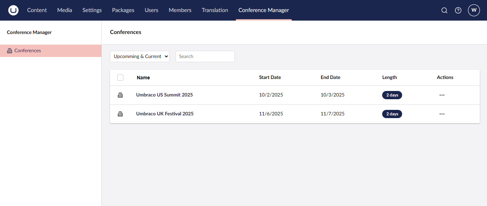
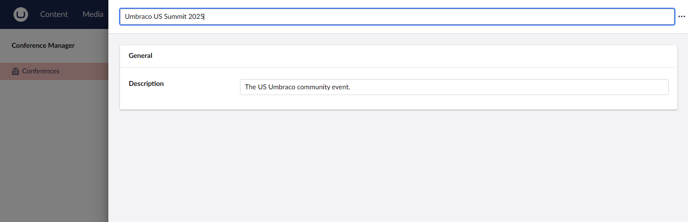
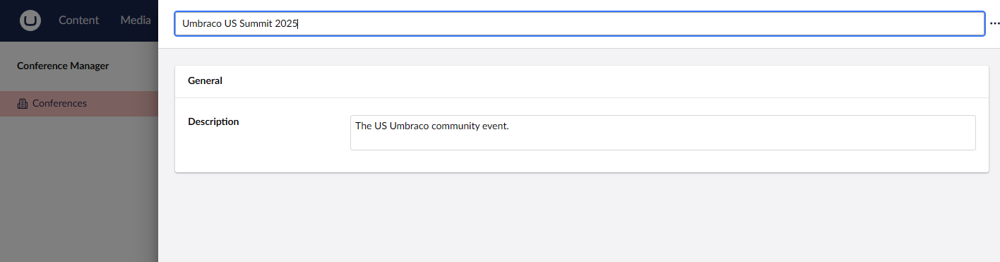
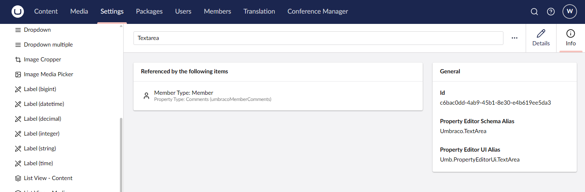
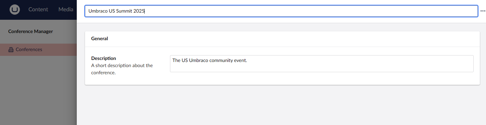
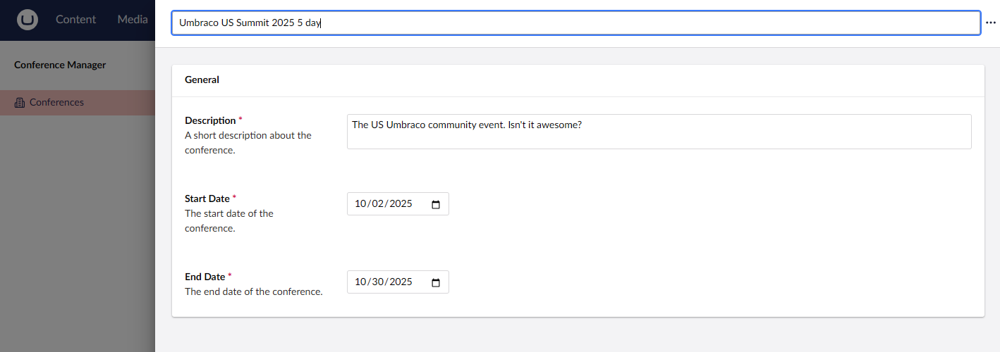

# Lesson 4: CRUD Entities
In this lesson we will learn how to configure the editing experiance for a backoffice user. 

## Defining the operations which can be performed on a collection
Inside of the collection configuration you are able to decide which operations can be performed by a backoffice user and also which ones are avaliable based on a certain user context.

For instance if we only want administrators to be able to create conference entities, we can do this with the `DisableCreate` extension method which can disable the operation completely, or based on a runtime evaluation. We will be using this evaluation to check it the current backoffice user is an administrator, and remove the functionality otherwise.

Add the following snippet the collection configuration:

```csharp
// Define Operations
collectionConfiguration.DisableCreate(context => !context.UserGroups.Any(x => x.Alias == "admin"));
```

Restart the application and your view should be no different and the create buttoon should still be on the list view.

Now go and create a new user in the backoffice which is an `Editor`. When you log in as them, you will see that the create option is no longer avaliable.



This same pattern can be applied to other parts of UI Builder such as list columns, properties, and property groups.

## Defining the editing experiance
UI Builder sets up the editor in the same format as you would configuring a document type except expressing it in the fluent syntax. This means that first you will deine a tab to display to the editor. Then define the groups which would be in that tab. Finally you will put the editable properties of the entity into the group. You may optionally also decide to put properties in a sidebar which mimics the look of the Info tab when looking at a piece of content within Umbraco.

Lets start by configureing the `Description` property to be avaliable to the editor. Copy the folloing snippet into the collection configuration to get started. 

```csharp
// Define Editing Experiance
collectionConfiguration.Editor(editorConfiguration =>
{
    editorConfiguration.AddTab("Details", tabConfigurtion =>
    {
        tabConfigurtion.AddFieldset("General", fieldsetConfiguration =>
        {
            fieldsetConfiguration.AddField(x => x.Description);
        });
    });
});
```

With that little bit of code we are already seeing things come together. We start by using the `Editor` method to give us access to the `EditorConfigBuilder` for our entity. From here we are able to add a tab using `AddTab` (which isnt shown as there is only one), the property group with the `AddFieldSet` and finally adding the editable field with `AddField`. Though you need to give names to the tabs and groups, UI Builder can generate the field name for you based off the property name. Since we configured the name property of the entity with `collectionConfiguration.SetNameProperty(x => x.Name);`, UI builder configures that field at the top of the editor like with a content name. 

Also notice that out of the box, UI Builder will try to match up the default property editor based on the type of the field. In this case description is a `string` so the Umbraco Textstring data type is used. This is one of the great features about UI Builder is that we can reuse the data types configured within Umbraco in our UI Builder configurations.



## Setting a Editor Type

Since this is a description, let's update the configuration so that we are using a Textarea instead of Textstring. Update the field configuration with the following:

```csharp
fieldsetConfiguration.AddField(x => x.Description, fieldConfiguration =>
{
    fieldConfiguration.SetDataType("Textarea");
});
```

We now are seeing that the Umbraco Textarea is being used as the editor instead of the Textstring.



And this is matching the data type configuration from the matching data type alias in Umbraco



### Additonal Configuration Options

Since we aim to make the editor experiance the best possible, don't forget to add descriptions to your fields to that your editors know what they are creating or updating. 

```csharp
fieldsetConfiguration.AddField(x => x.Description, fieldConfiguration =>
{
    fieldConfiguration.SetDataType("Textarea");
    fieldConfiguration.SetDescription("A short description about the conference.");
});
```



Now lets add the event dates to round out editing the `Conference` entity. Along with that we are going to setup simple validation so that the non nullable properties of our entity are required fields. Additionally we will add a default value to the date pickers so they aren't set to the beginning of time on create.

```csharp
tabConfigurtion.AddFieldset("General", fieldsetConfiguration =>
{
    fieldsetConfiguration.AddField(x => x.Description, fieldConfiguration =>
    {
        fieldConfiguration.SetDataType("Textarea");
        fieldConfiguration.SetDescription("A short description about the conference.");
        fieldConfiguration.MakeRequired();
    });
    
    fieldsetConfiguration.AddField(x => x.StartDate, fieldConfiguration =>
    {
        fieldConfiguration.SetDescription("The start date of the conference.");
        fieldConfiguration.SetDefaultValue(DateTime.Now.Date);
        fieldConfiguration.MakeRequired();
    });

    fieldsetConfiguration.AddField(x => x.EndDate, fieldConfiguration =>
    {
        fieldConfiguration.SetDescription("The end date of the conference.");
        fieldConfiguration.SetDefaultValue(DateTime.Now.Date);
        fieldConfiguration.MakeRequired();
    });
});
```



Now we have a fully configured entity which we can start editing. Try editing an existing entity and you can see the list view reflects the edits you make. Also we are able to create a entity from scratch along with deleting an entity. We now have a fully functioning CRUD interface with just a couple lines of code.