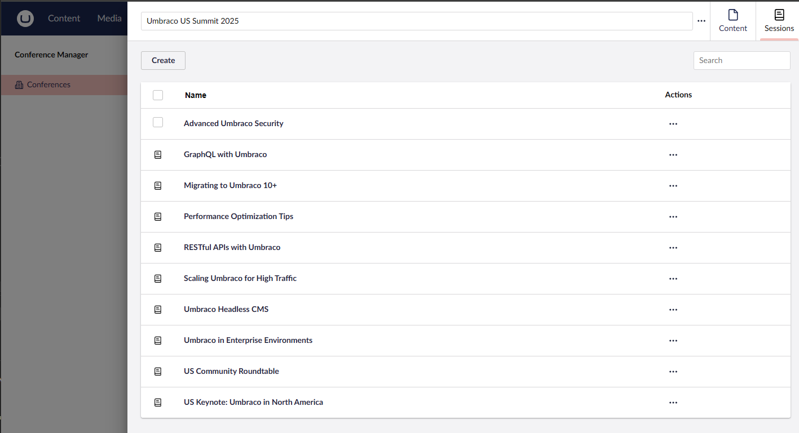
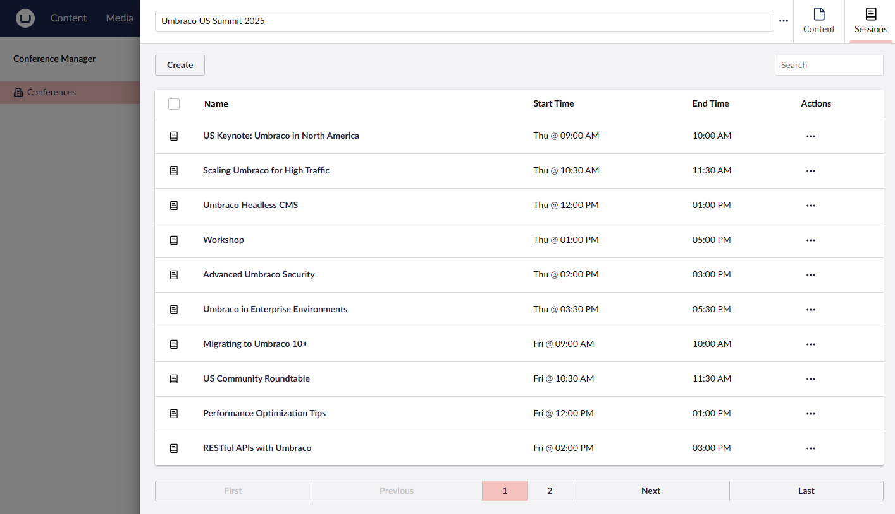
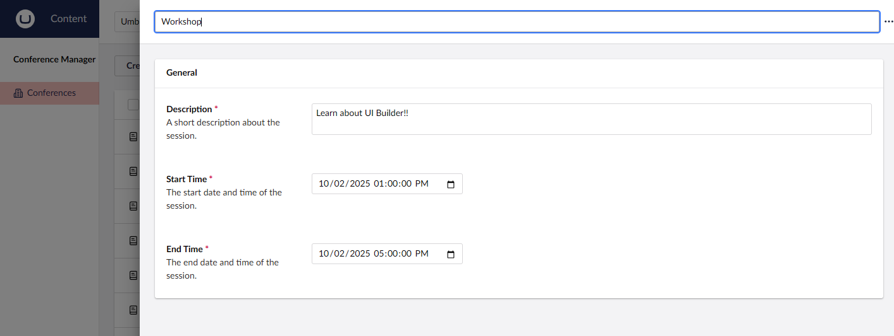

# Lesson 5: Creating Child Collections
## Configuring a Child Collection
Most of the time, entites do not live in isolation. There are relationships between different entites which need to be represeted to the editor. To create a one to many relationship between entites, we can use the UI Builder child collection configuration. 

This will allow us to edit the children of one entity inside of the editor of the parent. This keeps things organized as the parent entity will configure the listing and editor experiance of the child entity much like we did the base entity before.

We will do this by making a `Session` a child collection of `Conference`. This way we can CRUD Sessions within the Conferences editor. Lets begin by adding the following to the Conference collection builder.

```csharp
// Define the Session Child Collection
collectionConfiguration.AddChildCollection<Session>(x => x.Id,
                                                    x => x.ConferenceId,
                                                    "Session",
                                                    "Sessions",
                                                    "The sessions for a conference",
                                                    "icon-book",
                                                    "icon-book",
                                                    childCollectionConfiguration =>
                                                    {
                                                        childCollectionConfiguration.SetNameProperty(x => x.Title);
                                                    });
```

You'll notice that this is very similar to the top level `AddCollection` method that we used to create the `Conference` collection. The only real difference between the two is the second argument of the method. This is where we define the foreign key property of the `Session` entity so that UI Builder knows which Sessions to surface with this child collection to the matching Conference.



## Configuring the Child Collection List / Editor
From here, try to update the Session collection like we did the Conference collection by adding listing and editor configuration for it. 

Here is an example ending configuration for the Session collection that you could end up with. 

```csharp
// Define the Session Child Collection
collectionConfiguration.AddChildCollection<Session>(
x => x.Id,
x => x.ConferenceId,
"Session",
"Sessions",
"The sessions for a conference",
"icon-book",
"icon-book",
childCollectionConfiguration =>
{
    childCollectionConfiguration.SetNameProperty(x => x.Title);

    childCollectionConfiguration.SetSortProperty(x => x.StartTime);

    childCollectionConfiguration.ListView(listViewConfiguration =>
    {
        listViewConfiguration.AddField(x => x.StartTime).SetFormat(x => $"{x:ddd} @ {x:hh:mm tt}");
        listViewConfiguration.AddField(x => x.EndTime).SetFormat(x => $"{x:hh:mm tt}");
    });

    childCollectionConfiguration.Editor(editorConfiguration =>
    {
        editorConfiguration.AddTab("Details", tabConfigurtion =>
        {
            tabConfigurtion.AddFieldset("General", fieldsetConfiguration =>
            {
                fieldsetConfiguration.AddField(x => x.Description, fieldConfiguration =>
                {
                    fieldConfiguration.SetDataType("Textarea");
                    fieldConfiguration.SetDescription("A short description about the session.");
                    fieldConfiguration.MakeRequired();
                });

                fieldsetConfiguration.AddField(x => x.StartTime, fieldConfiguration =>
                {
                    fieldConfiguration.SetDataType("Date Picker with time");
                    fieldConfiguration.SetDescription("The start date and time of the session.");
                    fieldConfiguration.SetDefaultValue(DateTime.Now.Date);
                    fieldConfiguration.MakeRequired();
                });

                fieldsetConfiguration.AddField(x => x.EndTime, fieldConfiguration =>
                {
                    fieldConfiguration.SetDataType("Date Picker with time");
                    fieldConfiguration.SetDescription("The end date and time of the session.");
                    fieldConfiguration.SetDefaultValue(DateTime.Now.Date);
                    fieldConfiguration.MakeRequired();
                });
            });
        });
    });
 });
```

Notice the custom formatting on the list view to just show the day and time



And swapping out the default date picker which UI Builder assigns to `DateTime` objects with a configured data type which includes the time



If you stil have time try a to make data views to filter the list by `Level`.