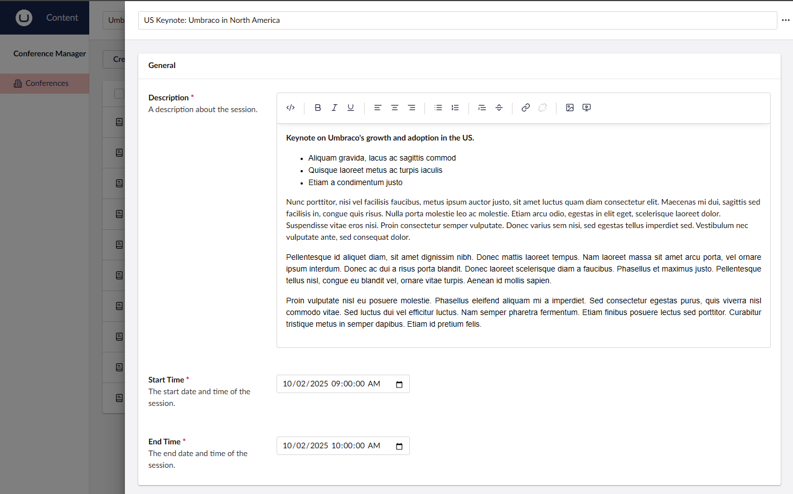
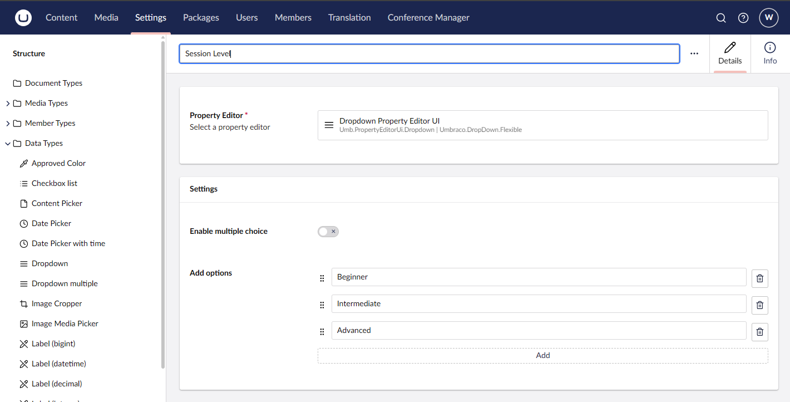
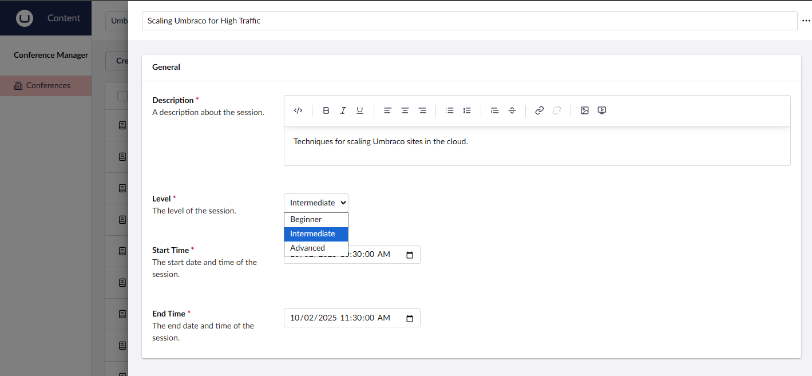

# Lesson 6: Value Mappers
Value mappers are helper classes which are used to convert data from the source entities property and convert it to the format that the target data type is expecting. This is useful when the data type is expecting a JSON object rather than just a basic `string` or `int` to display to the user. It also provides the method to convert the data type value back to the expected property value type.

## Create an RTE Value Mapper
Let's say that we have a requirment that editors should be able to create rich text around the session description. Right now we are just using a Textarea which does not give them much flexability.

The Umbraco rich text data type expects the data to come in the form of a JSON object which has the text and any blocks that need to be rendered, rather than just a flat string. 

```json
{
    markup: "<p>Lorem ipsum dolor sit amet</p>",
    blocks: []
}
```

To take our basic `string` property and convert it to the JSON object which the TipTap data type is expecting, create a class file in the `Core` project at `ValueConverters/TipTapValueMapper.cs` and have it inherit off of `ValueMapper`. Implement the interface and you will have a class definition like below.

```csharp
using Umbraco.UIBuilder.Mapping;

namespace UIBuilderWorkshop.Core.ValueConverters;

internal class TipTapValueMapper : ValueMapper
{
    public override object? EditorToModel(object? input)
    {
        throw new NotImplementedException();
    }

    public override object? ModelToEditor(object? input)
    {
        throw new NotImplementedException();
    }
}
```

The `ValueMapper` class has you implement two different abstract methods. `EditorToModel` needs to be implemented to take the representation of the data type value which is saved and convert it to the type which our entity property is expecting. Conversly, `ModelToEditor` should take the entity value and munge it into the format which the target data type is expecting.

Lets fill methods using the below implementations.

```csharp
using Microsoft.Extensions.Logging;
using Umbraco.Cms.Core;
using Umbraco.Cms.Core.Models.Blocks;
using Umbraco.Cms.Core.PropertyEditors;
using Umbraco.Cms.Core.Serialization;
using Umbraco.UIBuilder.Mapping;

namespace UIBuilderWorkshop.Core.ValueMappers;

/// <summary>
/// Maps values between the TipTap rich text editor and the string model representation.
/// </summary>
internal class TipTapValueMapper : ValueMapper
{
    private readonly IJsonSerializer _jsonSerializer;
    private readonly ILogger<TipTapValueMapper> _logger;

    public TipTapValueMapper(IJsonSerializer jsonSerializer, ILogger<TipTapValueMapper> logger)
    {
        _jsonSerializer = jsonSerializer ?? throw new ArgumentNullException(nameof(jsonSerializer));
        _logger = logger ?? throw new ArgumentNullException(nameof(logger));
    }

    /// <summary>
    /// Converts the editor value to the model value.
    /// </summary>
    /// <param name="input">The value from the editor.</param>
    /// <returns>
    /// The markup string if parsing is successful; otherwise, <c>null</c>.
    /// </returns>
    public override object? EditorToModel(object? input)
        => RichTextPropertyEditorHelper.TryParseRichTextEditorValue(input, _jsonSerializer, _logger, out var richTextEditorValue)
            ? richTextEditorValue.Markup
            : null;

    /// <summary>
    /// Converts the model value to the editor value.
    /// </summary>
    /// <param name="input">The model value, expected to be a markup string.</param>
    /// <returns>
    /// The serialized <see cref="RichTextEditorValue"/> if input is a string; otherwise, <c>null</c>.
    /// </returns>
    public override object? ModelToEditor(object? input)
    {
        if (input is not string markup) return null;

        var richTextEditorvalue = new RichTextEditorValue
        {
            Markup = markup,
            Blocks = new RichTextBlockValue(),
        };

        return RichTextPropertyEditorHelper.SerializeRichTextEditorValue(richTextEditorvalue,_jsonSerializer);
    }
}
```

Here we are implementing the `EditorToModel` method by using the exisitng `RichTextPropertyEditorHelper` helper to take the JSON string from the data type and get a `RichTextEditorValue` from it. From there we can take the markup and set that as the value to return for our property.

On the other side of the conversion in `ModelToEditor` we create the expected `RichTextEditorValue` from our data and use the `RichTextPropertyEditorHelper` to serialze it for the data type editor to use in the backoffice editor. 

> Note: Notice we are able to inject dependencies which are needed to perform the conversion. This is helpful if you need any additional services outside of the source and target data.

Lastly we need to update our Session editor configuration to use a rich text editor and configure this converter to be used when processing the data back and forth.

```csharp
fieldsetConfiguration.AddField(x => x.Description, fieldConfiguration =>
{
    fieldConfiguration.SetDataType("Richtext editor");
    fieldConfiguration.SetValueMapper<TipTapValueMapper>();
    fieldConfiguration.SetDescription("A description about the session.");
    fieldConfiguration.MakeRequired();
});
```

Now we are converting the data back and forth between our entity and the front end editor.



## Create an Enum Value Mapper

Another example of this is mapping a `int` enum from our source entity to a Umbraco dropdown which is matching on a predefined set of values. Start by creating a dropdown data type which is a Umbraco dropdown with names matching the `SessionLevel` names of the enum.



We will then create another value mapper `SessionLevelValueMapper` which will convert the int value to the enum name value and back.

```csharp
using System.Text.Json;
using UIBuilderWorkshop.Data.Enums;
using Umbraco.Cms.Core.Serialization;
using Umbraco.UIBuilder.Mapping;

namespace UIBuilderWorkshop.Core.ValueMappers;

internal class SessionLevelValueMapper : ValueMapper
{
    private readonly IJsonSerializer _jsonSerializer;

    public SessionLevelValueMapper(IJsonSerializer jsonSerializer)
    {
        _jsonSerializer = jsonSerializer ?? throw new ArgumentNullException(nameof(jsonSerializer));
    }

    public override object? EditorToModel(object? input)
    {
        if (input is string jsonString)
        {
            try
            {
                var values = _jsonSerializer.Deserialize<string[]>(jsonString);
                if (values?.Length > 0 && Enum.TryParse(typeof(SessionLevel), values[0], out var enumValue))
                {
                    return enumValue;
                }
            }
            catch (JsonException)
            {
                return null;
            }
        }
        return null;
    }

    public override object? ModelToEditor(object? input)
    {
        if (input is int enumValue)
        {
            var enumName = Enum.GetName(typeof(SessionLevel), enumValue);
            if (!string.IsNullOrEmpty(enumName))
            {
                var jsonString = _jsonSerializer.Serialize(new[] { enumName });
                return jsonString;
            }
        }
        return null;
    }
}

```

This mapper changes the int enum into the array of names the editor is expecting and back again. Setting the following configuration gives us the desired result in the backoffice.

```csharp
fieldsetConfiguration.AddField(x => x.Level, fieldConfiguration =>
{
    fieldConfiguration.SetDataType("Session Level");
    fieldConfiguration.SetValueMapper<SessionLevelValueMapper>();
    fieldConfiguration.SetDescription("The level of the session.");
    fieldConfiguration.SetDefaultValue((int)SessionLevel.Beginner);
    fieldConfiguration.MakeRequired();
});
```



We can take this one step further and make this a generic mapper for any enum we have in the system by using generics. Create the following class

```csharp
using System.Text.Json;
using Umbraco.Cms.Core.Serialization;
using Umbraco.UIBuilder.Mapping;

namespace UIBuilderWorkshop.Core.ValueMappers;

internal class SingleEnumtoUmbracoDropdownValueMapper<TEnumType>
    : ValueMapper where TEnumType : Enum
{
    private readonly IJsonSerializer _jsonSerializer;

    public SingleEnumtoUmbracoDropdownValueMapper(IJsonSerializer jsonSerializer)
    {
        _jsonSerializer = jsonSerializer ?? throw new ArgumentNullException(nameof(jsonSerializer));
    }

    public override object? EditorToModel(object? input)
    {
        if (input is string jsonString)
        {
            try
            {
                var values = _jsonSerializer.Deserialize<string[]>(jsonString);
                if (values?.Length > 0 && Enum.TryParse(typeof(TEnumType), values[0], out var enumValue))
                {
                    return enumValue;
                }
            }
            catch (JsonException)
            {
                return null;
            }
        }
        return null;
    }

    public override object? ModelToEditor(object? input)
    {
        if (input is int enumValue)
        {
            var enumName = Enum.GetName(typeof(TEnumType), enumValue);
            if (!string.IsNullOrEmpty(enumName))
            {
                var jsonString = _jsonSerializer.Serialize(new[] { enumName });
                return jsonString;
            }
        }
        return null;
    }
}
```

And then update the configuration to use this instead of the old mapper.

```csharp
fieldConfiguration.SetValueMapper<SingleEnumtoUmbracoDropdownValueMapper<SessionLevel>>();
```

Rerun the application and verify things are still working the same. Now we have a generic mapper which can be used for any other enums going forward.