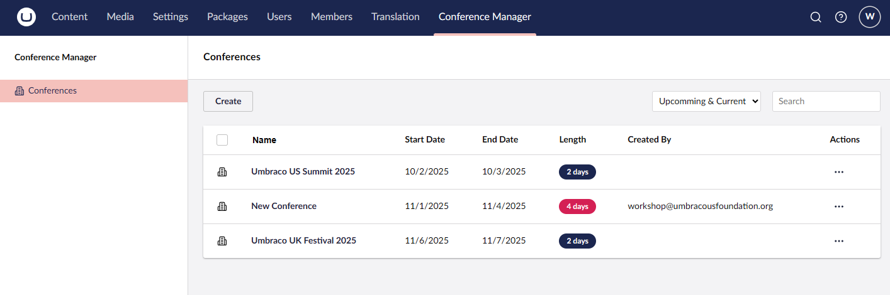
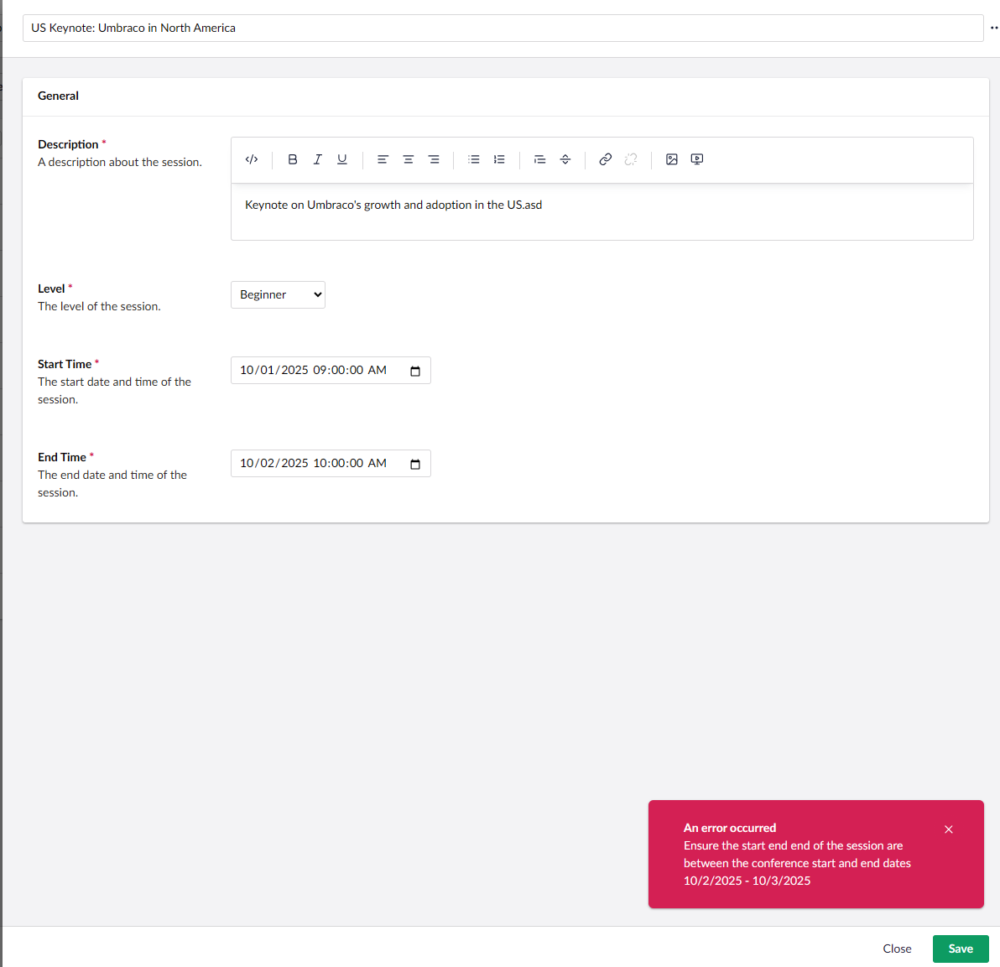

# Lesson 7: Notification Handlers
Notification handlers in UI Builder work much the same way as their Umbraco Notification counterparts. There are a set of notifications which the system can listen for and then handlers can be created to be executed when one of those notifications are emitted. 

## Automatically Add the Creator to the Entity
Say we have a requirement that we need to record the backoffice user who created the entity. We can do this using a notification handler and hook into the `EntitySavingNotification` notification to assign this value before the entity is saved.

Being by creating a class at `Notifications/AddCreatedByOnSaveHandler.cs` and have it implement the following interface `INotificationHandler<EntitySavingNotification>`

```csharp
using Umbraco.Cms.Core.Events;
using Umbraco.UIBuilder.Events;

namespace UIBuilderWorkshop.Core.Handlers;

internal class AddCreatedByOnSaveHandler : INotificationHandler<EntitySavingNotification>
{
    public void Handle(EntitySavingNotification notification)
    {
        throw new NotImplementedException();
    }
}

```

Next lets implement this method by injecting the backoffice service and setting the key of the logged in user as the value.

```csharp
using UIBuilderWorkshop.Data.Models;
using Umbraco.Cms.Core.Events;
using Umbraco.Cms.Core.Security;
using Umbraco.UIBuilder.Events;

namespace UIBuilderWorkshop.Core.Handlers;

/// <summary>
/// Handles the <see cref="EntitySavingNotification"/> to set the <c>CreatedBy</c> property
/// on entities derived from <see cref="ModelBase"/> when they are created.
/// </summary>
internal class AddCreatedByOnSaveHandler : INotificationHandler<EntitySavingNotification>
{
    private readonly IBackOfficeSecurityAccessor _securityAccessor;

    /// <summary>
    /// Initializes a new instance of the <see cref="AddCreatedByOnSaveHandler"/> class.
    /// </summary>
    /// <param name="securityAccessor">Provides access to the current back office security context.</param>
    /// <exception cref="ArgumentNullException">Thrown if <paramref name="securityAccessor"/> is <c>null</c>.</exception>
    public AddCreatedByOnSaveHandler(IBackOfficeSecurityAccessor securityAccessor)
    {
        _securityAccessor = securityAccessor ?? throw new ArgumentNullException(nameof(securityAccessor));
    }

    /// <summary>
    /// Handles the entity saving notification. If the entity is being created and is of type <see cref="ModelBase"/>,
    /// sets its <c>CreatedBy</c> property to the current user's key.
    /// </summary>
    /// <param name="notification">The notification containing the entity being saved.</param>
    public void Handle(EntitySavingNotification notification)
    {
        // Only do this on create which we can check by seeing if there is a before state
        if (notification.Entity.Before is not null) return;

        // Only do this for entities which are of our base type
        if (notification.Entity.After is not ModelBase modelBase) return;

        var user = _securityAccessor.BackOfficeSecurity?.CurrentUser;
        if (user is null || user.Key == Guid.Empty)
            return;

        modelBase.CreatedBy = user.Key;
    }
}

```

Using this class we are checking if this is a new entity and then making sure its of the type we are expecting so we can set the property. From there we are just using the backoffice accessor to aquire the current users GUID and recording it on the entity.

Register the handler in our extension method so that it will be called on saving of an entity.

```csharp
public static IUmbracoBuilder AddWorkshopUIBuilder(this IUmbracoBuilder umbracoBuilder)
{
    umbracoBuilder.AddNotificationHandler<EntitySavingNotification, AddCreatedByOnSaveHandler>();
    ...
}
```

Debug the handler and see how it is hit on every save, but the value is only assigned during create.

You could then, for example, surface that using a field view like in the previous lesson.

```csharp
@using Umbraco.Cms.Core.Services
@inject IUserService userService
@model Umbraco.UIBuilder.Web.Models.FieldViewContext

@{
    var targetName = string.Empty;
    if (Model.PropertyValue is string stringValue && Guid.TryParse(stringValue, out var guid)) {
        var user = await userService.GetAsync(guid);
        if (user != null) {
            targetName = user.Name;
        }
    }
}

@targetName
```

```csharp
listViewConfiguration.AddField(x => x.CreatedBy).SetView("GuidToBackofficeUser");
```



## Complex Validation
Handlers can also be used for performing complex validation before an entity is saved and returning that feedback to a user to fix any issues before a entity is saved.

### Session Dates in Conference Dates Validator
Lets say we have a business rule where we should be validating that the start and end dates of a session are within the parent conference dates which the session is under. We would start again by creating a saving handler class and registering it.

```csharp
using Umbraco.Cms.Core.Events;
using Umbraco.UIBuilder.Events;
using Umbraco.UIBuilder.Persistence;
using UIBuilderWorkshop.Data.Models;

namespace UIBuilderWorkshop.Core.Handlers;

/// <summary>
/// Handles the validation to ensure that session dates are within the parent conference's date range
/// when saving a <see cref="Session"/> entity.
/// </summary>
internal class EnsureSessionDatesInConferenceDatesHandler : INotificationHandler<EntitySavingNotification>
{
    private readonly IRepositoryFactory _repositoryFactory;

    /// <summary>
    /// Initializes a new instance of the <see cref="EnsureSessionDatesInConferenceDatesHandler"/> class.
    /// </summary>
    /// <param name="repositoryFactory">The repository factory used to access data repositories.</param>
    /// <exception cref="ArgumentNullException">Thrown if <paramref name="repositoryFactory"/> is null.</exception>
    public EnsureSessionDatesInConferenceDatesHandler(IRepositoryFactory repositoryFactory)
    {
        _repositoryFactory = repositoryFactory ?? throw new ArgumentNullException(nameof(repositoryFactory));
    }

    /// <summary>
    /// Handles the <see cref="EntitySavingNotification"/> event to validate session dates.
    /// Cancels the operation if the session's start or end time is outside the conference's date range.
    /// </summary>
    /// <param name="notification">The notification containing the entity being saved.</param>
    public void Handle(EntitySavingNotification notification)
    {
        // Only run for sessions
        if (notification.Entity.After is not Session session) return;

        // Get the parent Conference
        var conferenceRepository = _repositoryFactory.GetRepository<Conference, int>();
        var result = conferenceRepository.Get(session.ConferenceId);

        if (!result.Success)
        {
            notification.CancelOperation(new EventMessage("Data Error", "Unable to retrieve conference for session.", EventMessageType.Error));
        }

        var conference = result.Model;

        if (session.StartTime.Date < conference.StartDate || session.StartTime.Date > conference.EndDate || session.EndTime.Date > conference.EndDate)
        {
            notification.CancelOperation(new EventMessage("Validation Error", $"Ensure the start end end of the session are between the conference start and end dates {conference.StartDate:d} - {conference.EndDate:d}", EventMessageType.Error));
        }
    }
}

```

Now saving an invalid configuration will result in the save being blocked along with feedback to the user.



### Creating a Generic Validation Handler
While the above is nice, it will be harder to scale over time as we create more handlers. Each time we will have to create a handler and then register it over and over again with the same boilerplate code. Luckly we can make this more scalable by using dependency injection. This way we can create a generic business rule validation interface, and on save we can check to see if the current entity type has any of that interface registered to it and run those validators against our entity. 

Lets show this by creating a couple more validators using this method along with using this design pattern.

First create a interface in `Core` at `Validators/IBusinessRuleValidator.cs`

```csharp
using System.ComponentModel.DataAnnotations;
using UIBuilderWorkshop.Data.Models;

namespace UIBuilderWorkshop.Core.Validators;

/// <summary>
/// Defines a contract for validating business rules on entities of type <typeparamref name="TEntityType"/>.
/// </summary>
/// <typeparam name="TEntityType">
/// The type of entity to validate. Must inherit from <see cref="ModelBase"/>.
/// </typeparam>
internal interface IBusinessRuleValidator<TEntityType> where TEntityType : ModelBase
{
    /// <summary>
    /// Validates the specified entity against business rules.
    /// </summary>
    /// <param name="entity">The entity to validate.</param>
    /// <returns>
    /// An <see cref="ValidationResult"/> indicating the result of the validation,
    /// including any validation messages.
    /// </returns>
    ValidationResult Validate(TEntityType entity);
}

```

This will be the interface which we will create each rule we want to validate against. Next lets create the handler which will generically try to find these interfaces for the specific type we are interested in at `Handlers/BusinessRuleHandler.cs`

```csharp
using Microsoft.AspNetCore.Http;
using Microsoft.Extensions.DependencyInjection;
using System.ComponentModel.DataAnnotations;
using UIBuilderWorkshop.Core.Validators;
using UIBuilderWorkshop.Data.Models;
using Umbraco.Cms.Core.Events;
using Umbraco.UIBuilder.Events;

namespace UIBuilderWorkshop.Core.Handlers;

/// <summary>
/// Handles business rule validation for entities during the saving process.
/// </summary>
internal class BusinessRuleHandler : INotificationHandler<EntitySavingNotification>
{
    private readonly IHttpContextAccessor _httpContextAccessor;

    /// <summary>
    /// Initializes a new instance of the <see cref="BusinessRuleHandler"/> class.
    /// </summary>
    /// <param name="httpContextAccessor">The HTTP context accessor used to retrieve request services.</param>
    /// <exception cref="ArgumentNullException">Thrown if <paramref name="httpContextAccessor"/> is null.</exception>
    public BusinessRuleHandler(IHttpContextAccessor httpContextAccessor)
    {
        _httpContextAccessor = httpContextAccessor ?? throw new ArgumentNullException(nameof(httpContextAccessor));
    }

    /// <summary>
    /// Handles the <see cref="EntitySavingNotification"/> by validating business rules for the entity being saved.
    /// Cancels the operation if any business rule validation fails.
    /// </summary>
    /// <param name="notification">The notification containing the entity to validate.</param>
    public void Handle(EntitySavingNotification notification)
    {
        if (notification.Entity.After is not ModelBase) return;

        var entityType = notification.Entity.After.GetType();

        var serviceProvider = _httpContextAccessor.HttpContext?.RequestServices;
        if (serviceProvider is null) return;

        var entityCreateServiceType = typeof(IBusinessRuleValidator<>).MakeGenericType(entityType);
        var entityCreateServices = serviceProvider.GetServices(entityCreateServiceType);

        var validationErrorResults = new List<ValidationResult>();
        foreach (var service in entityCreateServices)
        {
            if (service is null) continue;

            var validateMethod = service.GetType().GetMethod("Validate");
            if (validateMethod != null)
            {
                var result = (ValidationResult)validateMethod.Invoke(service, [notification.Entity.After]);
                if (result != ValidationResult.Success)
                {
                    notification.CancelOperation(new EventMessage("Validation Error", result.ErrorMessage, EventMessageType.Error));
                    return;
                }
            }
        }
    }
}

```

Then we can add individual classes to validate a business rule. This keeps the implementation specific to just the business rule and how the error is handled downstream is left to the handler. This keeps the speration of concerns cleaner and also makes it easier to unit test our validators.

Add the following classes in the `Validators` folder.

Conference start and end date validator

```csharp
using System.ComponentModel.DataAnnotations;
using UIBuilderWorkshop.Data.Models;

namespace UIBuilderWorkshop.Core.Validators;

/// <summary>
/// Validates that the <see cref="Conference.StartDate"/> is on or before the <see cref="Conference.EndDate"/>.
/// </summary>
internal class EnsureConferenceStartDateBeforeEndValidator : IBusinessRuleValidator<Conference>
{
    /// <summary>
    /// Validates that the start date of the specified <paramref name="entity"/> is not after its end date.
    /// </summary>
    /// <param name="entity">The <see cref="Conference"/> entity to validate.</param>
    /// <returns>
    /// <see cref="ValidationResult.Success"/> if the start date is on or before the end date;
    /// otherwise, a <see cref="ValidationResult"/> with an error message.
    /// </returns>
    public ValidationResult Validate(Conference entity)
    {
        return entity.StartDate <= entity.EndDate
            ? ValidationResult.Success
            : new ValidationResult("The conference start date must be on or before the end date.", [nameof(entity.StartDate)]);
    }
}

```

Session end date validator
```csharp
using System.ComponentModel.DataAnnotations;
using UIBuilderWorkshop.Data.Models;
using Umbraco.UIBuilder.Persistence;

namespace UIBuilderWorkshop.Core.Validators;

/// <summary>
/// Validates that the end time of a session falls within the start and end dates of its parent conference.
/// </summary>
internal class EnsureSessionEndInConferenceDatesValidator : IBusinessRuleValidator<Session>
{
    private readonly IRepositoryFactory _repositoryFactory;

    /// <summary>
    /// Initializes a new instance of the <see cref="EnsureSessionEndInConferenceDatesValidator"/> class.
    /// </summary>
    /// <param name="repositoryFactory">The repository factory used to access conference data.</param>
    /// <exception cref="ArgumentNullException">Thrown if <paramref name="repositoryFactory"/> is null.</exception>
    public EnsureSessionEndInConferenceDatesValidator(IRepositoryFactory repositoryFactory)
    {
        _repositoryFactory = repositoryFactory ?? throw new ArgumentNullException(nameof(repositoryFactory));
    }

    /// <summary>
    /// Validates that the session's end time is within the conference's start and end dates.
    /// </summary>
    /// <param name="session">The session to validate.</param>
    /// <returns>
    /// A <see cref="ValidationResult"/> indicating success if the session's end time is valid,
    /// or an error message if it is outside the conference's date range.
    /// </returns>
    public ValidationResult Validate(Session session)
    {
        // Get the parent Conference
        var conferenceRepository = _repositoryFactory.GetRepository<Conference, int>();
        var result = conferenceRepository.Get(session.ConferenceId);

        if (!result.Success)
        {
            return new ValidationResult("Unable to retrieve conference for session.", [nameof(session.ConferenceId)]);
        }

        var conference = result.Model;

        if (session.EndTime.Date < conference.StartDate || session.EndTime.Date > conference.EndDate)
        {
            return new ValidationResult(
                $"Ensure the end of the session is between the conference start and end dates {conference.StartDate:d} - {conference.EndDate:d}",
                [nameof(session.EndTime)]);
        }

        return ValidationResult.Success;
    }
}

```

Session start date validator
```csharp
using System.ComponentModel.DataAnnotations;
using UIBuilderWorkshop.Data.Models;
using Umbraco.UIBuilder.Persistence;

namespace UIBuilderWorkshop.Core.Validators;

/// <summary>
/// Validates that a session's start time falls within the start and end dates of its parent conference.
/// </summary>
/// <remarks>
/// This validator ensures business rules are enforced so that sessions cannot be scheduled outside the conference duration.
/// </remarks>
internal class EnsureSessionStartInConferenceDatesValidator : IBusinessRuleValidator<Session>
{
    private readonly IRepositoryFactory _repositoryFactory;

    /// <summary>
    /// Initializes a new instance of the <see cref="EnsureSessionStartInConferenceDatesValidator"/> class.
    /// </summary>
    /// <param name="repositoryFactory">The repository factory used to access conference data.</param>
    /// <exception cref="ArgumentNullException">Thrown if <paramref name="repositoryFactory"/> is null.</exception>
    public EnsureSessionStartInConferenceDatesValidator(IRepositoryFactory repositoryFactory)
    {
        _repositoryFactory = repositoryFactory ?? throw new ArgumentNullException(nameof(repositoryFactory));
    }

    /// <summary>
    /// Validates that the session's start time is within the parent conference's start and end dates.
    /// </summary>
    /// <param name="session">The session entity to validate.</param>
    /// <returns>
    /// A <see cref="ValidationResult"/> indicating success if the session's start time is valid;
    /// otherwise, a result with an error message.
    /// </returns>
    public ValidationResult Validate(Session session)
    {
        // Get the parent Conference
        var conferenceRepository = _repositoryFactory.GetRepository<Conference, int>();
        var result = conferenceRepository.Get(session.ConferenceId);

        if (!result.Success)
        {
            return new ValidationResult("Unable to retrieve conference for session.", [nameof(session.ConferenceId)]);
        }

        var conference = result.Model;

        if (session.StartTime.Date < conference.StartDate || session.StartTime.Date > conference.EndDate)
        {
            return new ValidationResult(
                $"Ensure the start of the session is between the conference start and end dates {conference.StartDate:d} - {conference.EndDate:d}",
                [nameof(session.StartTime)]
            );
        }

        return ValidationResult.Success;
    }
}

```

Now we have 3 different business rule validators targeting different types, but they will all be run by the same handler so there is no need to create a handler for each rule.

Update our registration of the handler and classes to 

```csharp
public static IUmbracoBuilder AddWorkshopUIBuilder(this IUmbracoBuilder umbracoBuilder)
{
    umbracoBuilder.AddNotificationHandler<EntitySavingNotification, AddCreatedByOnSaveHandler>();
    umbracoBuilder.AddNotificationHandler<EntitySavingNotification, BusinessRuleHandler>();
    
    umbracoBuilder.Services.AddSingleton<IBusinessRuleValidator<Conference>, EnsureConferenceStartDateBeforeEndValidator>();
    umbracoBuilder.Services.AddSingleton<IBusinessRuleValidator<Session>, EnsureSessionStartInConferenceDatesValidator>();
    umbracoBuilder.Services.AddSingleton<IBusinessRuleValidator<Session>, EnsureSessionEndInConferenceDatesValidator>();
    ...
}
```

Test the validation in the backoffice and the try creating your own validation classes.